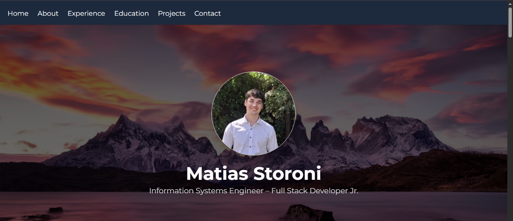

# Matías Storoni – Portfolio

[](https://matiasstoroni.vercel.app)
[](https://nextjs.org/)
[](https://tailwindcss.com/)

A modern, responsive personal portfolio showcasing projects, education, and experience. Built using **Next.js**, **TailwindCSS**, and modern web practices.



---

## 🚀 Features

- Smooth scroll navigation
- Responsive design with TailwindCSS
- Sticky header with mobile menu
- Project showcase with GitHub links
- Education timeline with certificates and project highlights
- Contact form with working email integration via EmailJS

---

## 🛠️ Built With

- ⚛️ **Next.js**
- 🎨 **TailwindCSS**
- 🧠 **React**
- ☁️ **Vercel** (for deployment)
- 📩 **EmailJS** (for contact form)
- 🐙 **GitHub** (for hosting code and project links)

---

## 📂 Structure Overview

```bash
.
├── components          
├── public              # Static assets (images, PDF resume)
├── styles              
├── pages               
└── .env.local          # Environment variables (e.g. EmailJS keys)
```

---

## 📄 Setup & Usage

```bash
# 1. Clone this repo
git clone https://github.com/MatiasStoroni/frontend-portfolio-next.git
cd frontend-portfolio-next

# 2. Install dependencies
npm install

# 3. Add your EmailJS credentials to `.env.local`
EMAILJS_SERVICE_ID=your_service_id
EMAILJS_TEMPLATE_ID=your_template_id
EMAILJS_PUBLIC_KEY=your_public_key

# 4. Run in development mode
npm run dev

# 5. Build for production
npm run build && npm start
```

---

## 📬 Contact

Feel free to reach out if you have a project or opportunity that fits my profile.

- 📧 Email: matias.storoni@gmail.com
- 🔗 LinkedIn: [linkedin.com/in/matias-storoni](https://www.linkedin.com/in/matias-storoni/)

